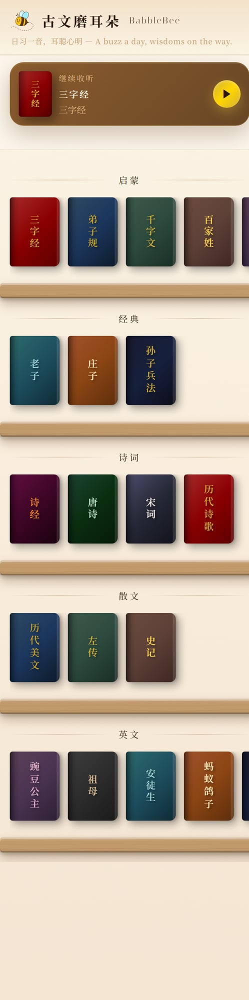

<p align="center">
  
</p>

<h1 align="center">BabbleBee 古文磨耳朵</h1>

<p align="center">
  <em>日习一音，耳聪心明 — A buzz a day, wisdoms on the way.</em>
</p>

<p align="center">
  <a href="https://babblebee.jiebuild.com">🌐 Live Demo</a>
</p>

---

## 📖 简介

**BabbleBee 古文磨耳朵** 是一个为儿童设计的中国经典国学音频学习网站。通过反复聆听（磨耳朵），让孩子在潜移默化中熟悉古文经典。

### 核心理念
- **重复是第一设计优先级** — 单曲循环、章节循环、顺序播放三种模式
- **磨耳朵而非死记硬背** — 通过反复聆听自然习得
- **亲子共读** — 提供原文 PDF，家长可对照文本陪孩子一起学

## 📖 About

**BabbleBee** is a classical Chinese audio learning website designed for children. Through repetitive listening ("ear grinding"), children naturally absorb the beauty and wisdom of classical Chinese literature.

### Core Philosophy
- **Repetition first** — Single loop, chapter loop, and sequential play modes
- **Immersion over memorization** — Learn through repeated listening
- **Parent-child reading** — Original text PDFs for parents to read along

---

## ✨ 功能 / Features

| 功能 | Feature | 说明 |
|------|---------|------|
| 📚 古典书架 | Classical Bookshelf | 木质纹理书架 UI，按类别浏览（启蒙/经典/诗词/散文/英文） |
| 🔁 三种循环模式 | 3 Loop Modes | 本章停止 → 单曲循环 → 顺序播放 |
| 📖 内嵌原文 | Inline PDF Viewer | Google Docs Viewer 渲染，支持翻页缩放 |
| 🎵 迷你播放条 | Mini Player Bar | 胶囊圆角设计，进度圆环，毛玻璃背景 |
| 💾 播放记忆 | Playback Memory | localStorage 记住上次播放位置和收听次数 |
| 📱 移动优先 | Mobile First | 响应式设计，触摸优化，横向滑动书架 |

---

## 📸 截图 / Screenshots

### 书架首页 / Bookshelf Home


### 书籍详情 / Book Detail


### 播放器 / Player


---

## 📚 收录内容 / Content Library

### 启蒙 Enlightenment
三字经 · 弟子规 · 千字文 · 百家姓

### 经典 Classics
老子 · 庄子 · 孙子兵法

### 诗词 Poetry
诗经 · 唐诗 · 宋词 · 历代诗歌

### 散文 Prose
历代美文 · 左传 · 史记

### 英文 English
The Princess and the Pea · Grandmother · Andersen's Fairy Tales · The Ant and the Dove · Aesop's Fables · Peter Rabbit · Nursery Rhymes

---

## 🛠 技术栈 / Tech Stack

- **前端**: 纯 HTML + CSS + JavaScript（零框架）
- **字体**: Noto Serif SC + ZCOOL XiaoWei + Italiana
- **图标**: Remix Icon
- **音频存储**: Azure Blob Storage
- **PDF 阅读**: Google Docs Viewer
- **部署**: Cloudflare Pages
- **域名**: babblebee.jiebuild.com

---

## 🚀 部署 / Deploy

```bash
# 安装 wrangler
npm install -g wrangler

# 部署到 Cloudflare Pages
wrangler pages deploy deploy/ --project-name babblebee --branch production
```

---

## 📁 项目结构 / Project Structure

```
deploy/
├── index.html      # 主页面
├── style.css       # 样式（木质书架主题）
├── app.js          # 应用逻辑（播放器、书架、路由）
├── books.json      # 书籍数据（分类、曲目、PDF 链接）
├── logo.png        # BabbleBee Logo
├── favicon.png     # 网站图标
└── screenshots/    # README 截图
```

---

## 📄 License

MIT

---

<p align="center">
  Made with ❤️ for 琪琪 and 晨晨
</p>
